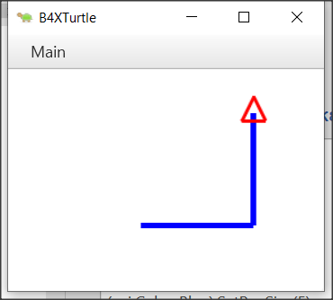

# **_Programación con B4X_**
- - - 
   Version 1.0, marzo 2021  
   Autor original: [Prokopis Leon](https://github.com/pliroforikos)  
   Traducido al español por [José Miguel López](https://github.com/Lamashino)  
   
- - -

# Tema 4 - Variables y Rango

| :clock3: 3 horas |
|:----------------|

Imagínate que vives en una calle con varios millones de casas seguidas;
cada casa tiene su dirección que comienza en el número 1 y termina con
el número de la última casa; para poder localizar a un amigo que vive en
esa calle es necesario conocer el número de la casa; así que tenemos por
un lado un número de casa y por otro el amigo que vive en esa casa.


**_Imagen 1. La memoria del ordendador (https://www.freepik.com)_**


La memoria central de la computadora funciona de la misma manera. Hay
muchas casas cada una con su dirección y un \"residente\" dentro de cada
casa. Esta dirección se denomina **dirección de memoria** y al
"residente" se le llama contenido. En el ordenador muchas veces el
\"residente\" (que llamaremos **variable**) necesita varis casas para
poder tener hueco.

Para que un programador utilice la memoria, debe conocer los datos que
necesita y el tipo de datos. Estos pueden ser números enteros o reales,
palabras o letras o valores lógicos (verdadero o falso). También
necesita un \"hogar\" en la memoria de la computadora para almacenarlos
representados por la dirección.

En B4X los datos se pueden almacenar en diferentes tipos como:

|**B4X**   | **Tipo de dato**                                  |
|----------|---------------------------------------------------|
| Boolean  | Booleano o lógico (verdadero/falso)               |
| Byte     | Entero de 8 bits (de 0 a 255)                     |
| Short    | Entero de 16 bits (0 a 65535)                     |
| Int      | Entero de 32 bits (0 a 4.294.967.296)             |
| Long     | Entero largo de 64 bits (0 a 2^64^)               |
| Float    | Número decimal de 32 bits                         |
| Double   | Número decimal de doble precisión de 64 bits      |
| Char     | Carácter ('a', '1', '%', etc.)                    |
| String   | Cadena de caracteres ("hola", "adiós", "juan",...)|

*__Tabla 1- Tipos básicos de las variables__*

Cada tipo necesita un espacio diferente en la memoria para almacenar su
contenido.

Debido a que es difícil para el desarrollador recordar todas las
direcciones de sus datos, a cada dirección se le pone un nombre. Por
suerte, esto lo hace el propio lenguaje de programación y todo lo que se
necesita es pensar en un buen nombre para tus datos. Por ejemplo, un
dato que sea un número entero para la edad podría llamarse \"edad\".
Ahora, hay un \"hogar\" llamado edad en la memoria de la computadora.


> **_RECUERDA_**  
> Las variables se utilizan para almacenar información para ser referenciada y manipulada en un programa. También proporcionan una forma de etiquetar los datos con un nombre descriptivo, para que el lector y nosotros mismos podamos entender nuestros programas con mayor claridad. Es útil pensar en las variables como contenedores que contienen información


## 4.1. Cómo averiguar cuántas variables necesitas

En cualquier problema de programación que encuentre un desarrollador,
debería poder ubicar los datos y la información del problema.

En programación debemos dar un nombre a todos aquellos elementos que
necesitamos conocer para resolver un problema. Normalmente en un
problema de programación los podemos extraer del enunciado del ejercicio
con la ayuda de verbos clave como:

-   Leer
-   Registrar
-   Preguntar
-   Aceptar
-   Teclear

*Ejemplo 1: Escribe un programa que convierta los euros que
[escribimos]{.ul} en dólares.*

*Ejemplo 2: Haga un programa que [acepte]{.ul} un número entero positivo
y calcule su cuadrado, cubo y raíz cuadrada.*

**Información**

La Información en un programa es la transformación que tenemos que
aplicar a los datos para conseguir un resultado deseado. Normalmente la
manera de obtener la información la podemos obtener del enunciado del
problema fijándonos en palabras clave como:

-   Calcular
-   Mostrar
-   Escribir
-   Contar
-   Convertir

¿Qué debemos calcular en los ejemplos anteriores?

## 4.2. Cómo dar nombre a las Variables

Los nombres de las variables en B4X deben seguir estas reglas:

-   Deben comenzar con mayúscula o minúscula.
-   Después, pueden tener dígitos o el carácter de subrayado (\_).
-   B4X no distingue entre mayúsculas y minúsculas.

Además, es una buena práctica poner 3 letras delante del nombre de la
variable indicando el tipo de variable que es y continuar con 1 letra
mayúscula y una palabra significativa. Por ejemplo:

-   Dim **intEdad** as Int
-   Dim **fltCantidad** as Float
-   Dim **strNombre** as String

Esto te ayudará mucho cuando encuentre una variable en el código
pudiendo así reconocer el tipo y el valor que almacena.

## 4.3. Declaración de Variables

>   **_MI PRIMERA VARIABLE_**  
> Escribe un programa que asigne un valor a un número entero y luego dibuje con la ayuda de la tortuga una línea de longitud tan larga como el valor de la variable

En B4X, para usar una variable, primero debemos informar al lenguaje de
su existencia para que le asigne espacio en la memoria del ordenador
para almacenar su valor.

Por ejemplo, en el siguiente código, la declaración es la siguiente:

```vbnet
'Programa: Mi primera variable
Sub Turtle_Start
  Private intDistancia As Int
  Public intGiro As Int
  intDistancia = 100
  intGiro = 90
  
  Turtle.SetPenColor(xui.Color_Blue).SetPenSize(5)
  Turtle.MoveForward(intDistancia)
  Turtle.TurnLeft(intGiro)
  Turtle.MoveForward(intDistancia)
End Sub
```
Obtendríamos el siguiente resultado en pantalla:



La declaración de variables comienza con la palabra clave **Private** o
**Public**.

**Private** significa que la variable se conoce solo en el espacio
específico declarado y ningún otro programa o subprograma conoce su
existencia y, por lo tanto, el valor que contiene.

En cambio, una declaración de variable que comienza con la palabra clave
**Public** puede ser conocida por otros programas, subprogramas o
clases, etc.

Después de la palabra clave **Private** o **Public** sigue el nombre de
la variable. Aquí es donde se aplican las reglas discutidas
anteriormente. Finalmente, sigue el tipo de variable. Para variables
simples, los tipos son todos los descritos en la **Tabla 1 - Tipos básicos de las variables**.

> **_CONSEJO PARA EL PROFESOR_**  
> No es necesario que explique todas las variables ni su uso. Para que sus estudiantes comiencen a programar, los conceptos básicos de integer, float, string son suficientes. A medida que avanza en los cursos, puede incluir otros tipos según sus necesidades.

## 4.4. Comentarios 

En programación un comentario es una explicación o anotación que se
escribe en el código fuente de un programa. Se agregan con el propósito
de hacer que el código fuente sea más fácil de entender para los humanos
y generalmente son ignorados por compiladores e intérpretes. La sintaxis
de los comentarios en varios lenguajes de programación varía
considerablemente. (Wikipedia, 2021)

En B4X, los comentarios se insertan poniendo el carácter \' (comilla
simple) antes del comentario. Ese carácter hace que se ignore todo lo
que viene a continuación. Generalmente, los comentarios se suelen poner
en lugares donde es importante recordar lo que se está haciendo. Los
comentarios se distinguen fácilmente en el código por el color verde que
les da el entorno de programación (IDE).

**Ejemplo**

```vbnet
'Programa: Mi Primera Variable
'Este programa dibuja un ángulo recto cuyos lados son tan largos\
'como el valor de la variable intDistancia

Sub Turtle_Start
    Private intDistancia As Int
    Public intGiro As Int
    intDistancia = 100   'Longitud de los lados del ángulo recto
    intGiro = 90         '90 grados del ángulo recto
    
    Turtle.SetPenColor(xui.Color_Blue).SetPenSize(5)
    Turtle.MoveForward(intDistancia)
    Turtle.TurnLeft(intGiro)
    Turtle.MoveForward(intDistancia)
End Sub
```

## 4.5. El área de log y la función log

Cuando se programa se suelen producir errores. Generalmente, los errores
en la programación se dividen en dos categorías: **sintácticos** y
**lógicos**. Por ahora trataremos los errores de sintaxis que son
reconocidos por el lenguaje de programación y los indicaremos en la
pantalla de logs. Para acceder a la pantalla de Logs, debemos hacer clic
en la **pestaña de** **Log** en la parte inferior derecha.

{width="5.772222222222222in"
height="3.0868055555555554in"}

*Figura 2. Pantalla de Log*

La pantalla de Logs está dividida en dos zonas; en la superior se
muestran los errores y en la inferior los mensajes generador por el
propio lenguaje B4J o bien aquella información que nosotros hemos dicho
que queremos mostrar con la función **Log()**. El uso de la función
**Log ()** te ayuda a mostrar mensajes mientras se ejecuta un programa,
así como valores de variables para ayudar a controlar el correcto
funcionamiento del programa.

Para mostrar cualquier información en la pantalla es suficiente usar la
función **log ()** como en la siguiente imagen.

{width="5.772222222222222in"
height="2.2243055555555555in"}

*Figura 3. Uso de la función Log*

## 4.6. Operadores matemáticos

B4X admite todas las operaciones matemáticas más comunes:

  **Operador**   **Ejemplo**       **Operación**
  -------------- ----------------- ----------------------
  \+             x + y             Suma
  \-             x - y             Resta
  \*             x \* y            Multiplicación
  /              x / y             División
  Mod            x Mod y           Resto de la división
  Power          Power(x,y) x^y^   Potencia

Ejemplos:

Private intA, intB, intC, intS As Int

Private fltD, fltM As Float

intA = 40

intB = 20

intC = 30

intS = intA + intB + intC

Log(intS) 'Muestra 90

fltD = intS / 3

Log(fltD) 'Muestra 30

intA = intAa + 1 'Incrementar intA en 1

Log(intA) 'Muestra 41

intS = Power(intA -- 11, 2) ' 30^2^

Log(intS) 'Muestra 900 (30\*30)

fltM = intA mod 2 'Resto de dividir 41 entre 2

Log(fltM) 'Muestra 1

## 4.7. Cadenas 

En programación de ordenadores, una cadena es tradicionalmente una
secuencia de caracteres, ya sea una constante literal o una variable. En
este último caso se puede cambiar su contenido y también su longitud, o
puede ser de longitud fija (después de crearla) (Wikipedia, Wikipedia -
Strings, 2021).

Una cadena se declara como las otras variables usando la declaración
**String**

Private strNombre as String

La asignación de valor a una cadena se puede hacer con el símbolo = o
leyendo un valor que escribe el usuario (algo que veremos más adelante).

Private strNombre, strApellidos as String

strNombre = "Juan"

strApellidos = "García Gómez"

También podemos unir dos cadena usando el carácter &

Private strNombre, strApellidos as String

strNombre = "Juan"

strApellidos = "García Gómez"

Private strPersona as String

strPersona = strNombre & " " & strApellidos

log(strPersona) ' Muestra Juan García Gómez en la pantalla de Log

Private strNombre2 as String

strNombre2 = "Antonio"

strNombre2 = strNombre2 & " López"

También hay muchas funciones para trabajar con cadenas que son muy
útiles:

  **CharAt**(Índice)                Devuelve el carácter en el índice dado.
  --------------------------------- -----------------------------------------------------------------------------------------------------------
  **CompareTo**(Otra)               Compara lexicográficamente la cadena con la Otra cadena.
  **Contains**(SearchFor)           Comprueba si la cadena contiene la cadena SearchFor dada.
  **EndsWith**(Sufijo)              Devuelve True si la cadena termina con la subcadena de sufijo dada.
  **EqualsIgnoreCase**(Otra)        Devuelve True si ambas cadenas son iguales ignorando si están en mayúsculas o minúsculas.
  **Length**                        Devuelve la longitud, el número de caracteres, de la cadena.
  **Replace**(Destino, Reemplazo)   Devuelve una nueva cadena resultante de la sustitución de todas las apariciones de Destino con Reemplazo.
  **StartsWith**(Prefijo)           Devuelve True si esta cadena comienza con el prefijo dado.
  **ToLowerCase**                   Devuelve una nueva cadena que es el resultado de ponerla en minúsculas.
  **ToUpperCase**                   Devuelve una nueva cadena que es el resultado de ponerla en mayúsculas.
  **Trim**                          Devuelve una copia de la cadena original sin espacios en blanco iniciales o finales.

Tabla 2. Funciones de cadena
(https://www.b4x.com/android/documentation.html)

{width="5.76875in"
height="0.9444444444444444in"}

## Ejercicios

1.  En los siguientes ejercicios, identifica las variables que necesita
    declarar. Para cada uno de ellas, escriba la declaración y asígnele
    un nombre apropiado.

    -   Calcula el volumen de un cilindro con un radio de un metro y una
        altura de dos metros.

    -   Haga un programa que acepte un número entero positivo y calcule
        su cuadrado, cubo y raíz cuadrada.

    -   Haga un programa que lea una suma de dinero en € y calcule y
        muestre la cantidad correspondiente en \$.

    -   Escriba un programa que lea la longitud de los lados de un
        rectángulo desde el teclado y calcule y muestre su área.

    -   La resistencia total R de dos resistencias R1 y R2 conectadas en
        serie es R1 + R2 y paralelo (R1 \* R2) / (R1 + R2)
        respectivamente. Crea un programa que lea dos valores de
        resistencia R1 y R2 y calcule la resistencia total en serie y en
        paralelo y la muestre con la función "Log".

2.  En los siguientes nombres de variables, seleccione cuáles son
    correctas y cuáles no:

  **Nombre**      **Correcto**   **Incorrecto**
  --------------- -------------- ----------------
  int Edad        □              □
  \_fltCantidad   □              □
  strNombre       □              □
  1miEdad         □              □
  int_valor       □              □

3.  Es el final del trimestre y obtuviste tus calificaciones de tres
    clases: Geometría, Álgebra y Física. Crea un programa que:

    -   Guarde en 3 variables las calificaciones de estas 3 clases (las
        calificaciones van de 0 a 10)

    -   Calcule la nota media de sus calificaciones y la muestre con la
        función "Log".

4.  ¡Has comprado un Bitcoin y ahora está subiendo! Crea un programa
    que:

    -   Asigne el valor del bitcoin en el momento de la compra.

    -   Asigne el porcentaje de aumento (o disminución)

    -   Emplee la función "Log" para ver el valor total de tu bitcoin.

    -   Emplee la función "Log" para ver el valor de aumento o
        > disminución.

5.  Tienes una casa y deseas calcular su área total. Crea un programa
    que:

    1.  Lea el ancho y el alto en dos variables.

    2.  Calcule y muestre con la función "Log" el área total.

6.  Quieres comprar un nuevo portátil. Miras el precio y ves que el
    precio es de 300 euros sin incluir el IVA del 21%. Crea un programa
    que:

    1.  Asigne el precio del portátil en una variable.

    2.  Asigne el porcentaje de impuestos en una segunda variable.

    3.  Calcule y muestre con la función "Log" el precio final con IVA.

7.  En una empresa, el salario mensual de un empleado se calcula
    partiendo del salario mínimo de 400 € al mes, más 20€ multiplicado
    por el número de años empleados, más 30€ por cada hijo que tenga.
    Cree un programa que:

1\. Asigne el número de años del empleado en una variable.

2\. Asigne el número de hijos que tiene el empleado en la segunda
variable.

3\. Calcule y muestre con la función "Log" el salario del empleado.

8.  Crea un programa que use la función "Log" para mostrar el último
    dígito de un número entero dado.

9.  Crea dos variables 'a' y 'b' y ponles un valor inicial diferente a
    cada una. Escribe un programa que intercambie ambos valores.

Ejemplo: a = 10, b = 20

Salida: a = 20, b = 10

10. Crea dos variables 'a' y 'b' y ponles un valor inicial diferente a
    cada una. Escribe un programa que doble el valor de la variable 'a'
    e incremente el valor de la varialbe 'b' en 1.

Ejemplo: a = 10, b = 20

Salida: a = 20, b = 21
